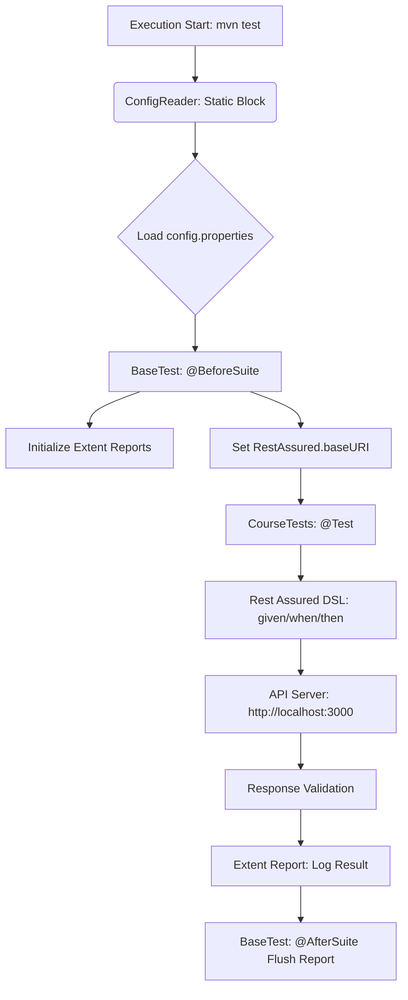
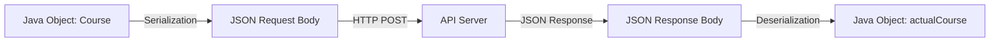
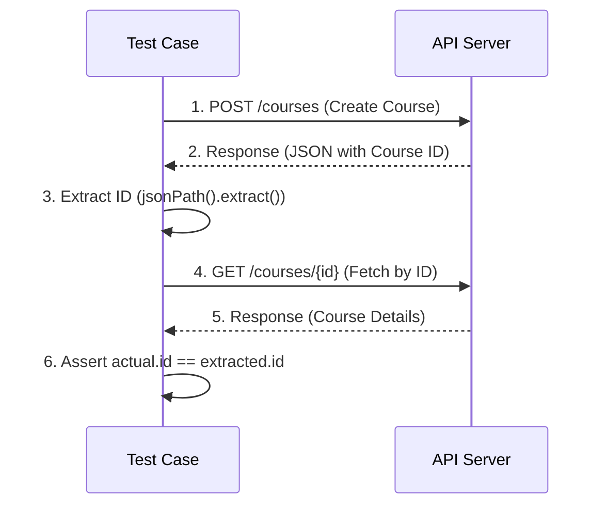

# Rest Assured Mastery Notes 📝

## 🌟 Module 1: Introduction to Rest Assured

### What is Rest Assured?
Rest Assured is a Java library that provides a domain-specific language (DSL) for writing powerful, maintainable tests for RESTful APIs. It is highly inspired by dynamic languages like Ruby and Groovy.

### Why Rest Assured?
- Easy to use (Given-When-Then syntax).
- Excellent support for JSON and XML.
- Integrates well with testing frameworks like TestNG and JUnit.
- Supports all HTTP methods (GET, POST, PUT, DELETE, etc.).

### Basic Syntax: Gherkin Style
1.  **Given**: Pre-requisites (Base URI, Headers, Query Params, Path Params, Body).
2.  **When**: Action (HTTP Method - GET, POST, etc.).
3.  **Then**: Validation (Status code, Response body, Headers).

---

## 🗺️ Visual Architecture & Application Flow

### 1. Framework Execution Flow
This diagram shows how the components interact when you run a test.



### 2. The Serialization & Deserialization Flow
How Java Objects (POJOs) communicate with the API.



### 3. Request Chaining Flow
The logic behind passing dynamic data (like IDs) between multiple API calls.



---

## 🛠️ Step 1: Project Setup
We have initialized a Maven project with the following core dependencies:
- `rest-assured`: The core library.
- `testng`: To run and organize our tests.
- `jackson-databind`: To handle JSON serialization/deserialization.
- `hamcrest`: For rich assertions.

---

## 🏗️ Standard API Framework Structure
A professional automation framework follows a modular approach:

1.  **Base Class**: Handles common configurations (BaseURI, BasePath, Logs).
2.  **POJOs (Plain Old Java Objects)**: Used for Serializing and Deserializing JSON bodies.
3.  **Utility Classes**: For reading Properties files, Excel data, or Database connections.
4.  **Endpoints/Constants**: Storing all API routes in one place for easy maintenance.
5.  **Tests**: Pure test logic using Assertions.

---

## 🚀 Concept 1: Your First GET Request (Professional Style)
Instead of hardcoding, we now extend `BaseTest` to inherit all configurations.

**Example Code:**
```java
public class CourseTests extends BaseTest {
    @Test
    public void testGetAllCourses() {
        given()
            .log().all()
        .when()
            .get("/courses")
        .then()
            .statusCode(200);
    }
}
```

---

## 🛠️ Framework Components Overview

| Component | Responsibility |
| :--- | :--- |
| `config.properties` | Central storage for URLs, Credentials, and Environment data. |
| `ConfigReader.java` | Utility to fetch data from properties files dynamically. |
| `BaseTest.java` | Parent class that initializes Rest Assured and global settings. |
| `CourseTests.java` | Test implementation class focusing on business logic. |

---

## 💻 Useful Maven Commands

| Command | Action |
| :--- | :--- |
| `mvn test` | Runs all tests in the project. |
| `mvn test -Dtest=ClassName` | Runs only the specified test class. |
| `mvn clean test` | Cleans the `target` folder and runs all tests. |
| `cd rest-assured-pro && mvn test` | Run the Rest Assured Suite. |
| `cd karate-framework && mvn test` | Run the Karate Suite. |

---

## 📤 Concept 2: Creating Resources (POST Request)
To create a new resource on the server, we use the `POST` method.

**Key Requirements:**
1.  **Request Body**: The data we want to send (usually in JSON format).
2.  **Content-Type**: We must tell the server we are sending JSON using `.contentType(ContentType.JSON)`.
3.  **Success Code**: A successful creation usually returns `201 Created`.

**Example Snippet:**
```java
given()
    .contentType(ContentType.JSON)
    .body("{\"title\": \"New Course\", \"price\": 1000}")
.when()
    .post("/courses")
.then()
    .statusCode(201);
```

---

## 🔍 Concept 3: JSONPath & Request Chaining
In advanced automation, we often need to extract a value from one response to use it in the next request.

**Key Tools:**
1.  **`.extract().path("json.path")`**: This method allows us to grab a specific value (like an `id`) from the JSON response.
2.  **JSONPath**: A query language for JSON (similar to XPath for XML).

**Workflow:**
- **Step A**: Send a POST request to create a resource.
- **Step B**: Extract the `id` from the success response.
- **Step C**: Use that `id` to fetch or update the same resource.

**Example Snippet:**
```java
String courseId = given()
    .body(payload)
.when()
    .post("/courses")
.then()
    .extract().path("data.id");

System.out.println("New Course ID is: " + courseId);
```

---

## 🏗️ Concept 4: POJOs & Serialization
In a professional framework, we don't send JSON as a "String." We use **POJOs (Plain Old Java Objects)**.

### 1. What is Serialization?
The process of converting a **Java Object** into a **JSON String** (automatically handled by Rest Assured using the Jackson library).

### 2. Why use POJOs?
- **Type Safety**: Avoids syntax errors in JSON strings.
- **Reusability**: One POJO can be used for Create, Update, and Get operations.
- **Readability**: Using Getters and Setters is much cleaner.

**Example Snippet:**
```java
Course course = new Course("Java Mastery", 2000);
given()
    .body(course) // Automatically Serialized to JSON!
.when()
    .post("/courses");
```

---

## 🔄 Concept 5: Deserialization
Deserialization is the process of converting a **JSON Response** back into a **Java Object**.

### 1. How to use it?
We use the `.as(ClassName.class)` method in Rest Assured.

### 2. Why use it?
- **Strong Assertions**: You can use Java methods to compare objects.
- **Data Reuse**: You can take a course object from a GET response and immediately use it in a PUT (Update) request.
- **Clean Assertions**: Using `Assert.assertEquals()` with object getters is much more readable.

**Example Snippet:**
```java
Course course = given()
    .get("/courses/123")
.then()
    .extract().as(Course.class); // 🔄 JSON to Java Object!

System.out.println("Title from Object: " + course.getTitle());
```

---

## 📊 Concept 6: Data-Driven Testing (DDT)
Data-Driven Testing allows you to run the same test case multiple times with different sets of data.

### 1. What is `@DataProvider`?
It is a TestNG annotation used to supply data to a test method. It returns a 2D array of objects (`Object[][]`).

### 2. Benefits
- **Efficiency**: Run 100 test cases with just one method.
- **Maintenance**: If the logic changes, you only update one place.
- **Coverage**: Easily test different data combinations (valid/invalid).

**Example Snippet:**
```java
@DataProvider(name = "courseData")
public Object[][] getData() {
    return new Object[][] {
        {"Course A", 1000},
        {"Course B", 2000}
    };
}

@Test(dataProvider = "courseData")
public void testCreate(String name, int price) {
    // This test runs twice!
}
```

---

## 🎯 Concept 7: Advanced Assertions (Hamcrest Matchers)
Validating just the status code is not enough. We must validate the **content** and **structure** of the response.

### 1. Common Hamcrest Matchers
- `equalTo(value)`: Checks for exact equality.
- `hasSize(number)`: Checks the size of a list/array.
- `hasItem(element)`: Checks if a list contains a specific item.
- `notNullValue()`: Ensures a field is not empty.
- `lessThan(number)` / `greaterThan(number)`: For numeric comparisons.

**Example Snippet:**
```java
.then()
    .body("data", hasSize(8)) // Check array length
    .body("data[0].price", equalTo("1999")) // Check specific item
    .body("success", is(true));
```

---

---

## 🧩 OOPs Concepts in our Framework

### 1. Inheritance (`extends`)
We used **Inheritance** by making `CourseTests` extend `BaseTest`. 
- **Benefit**: All test classes "inherit" the `setup()` method automatically. We write once, use everywhere.

### 2. Encapsulation
The `ConfigReader` class **encapsulates** the logic of reading the `config.properties` file.
- **Benefit**: The user of the framework doesn't need to know *how* the file is read, they just call `.getProperty("key")`.

### 3. Static Blocks & Methods
In `ConfigReader`, we used a **Static Block** to load properties.
- **Benefit**: The configuration is loaded into memory only **once** when the class is first accessed, making it memory-efficient.

### 4. Abstraction
By using a `BaseTest`, we **abstract** away the complexity of Rest Assured initialization from the actual test cases.

---

## 🔐 Concept 8: Authentication in APIs
Most professional APIs are secured. Rest Assured provides several ways to handle this.

### 1. Bearer Token (JWT)
This is the most common method. You send a token in the Header.
```java
given()
    .header("Authorization", "Bearer " + token)
.when()
    .get("/protected-route");
```

### 2. Basic Auth
Uses username and password.
```java
given()
    .auth().basic("username", "password")
.when()
    .get("/admin");
```

### 3. API Key
Passed as a query parameter or header.
```java
given()
    .queryParam("apiKey", "12345")
.when()
    .get("/weather");
```

---

## 📊 Concept 9: Professional Reporting (Extent Reports)
Automated tests are useless if you can't see the results in a clear, visual format.

### 1. Why use Extent Reports?
- **Visual Dashboard**: Pie charts for Pass/Fail status.
- **Detailed Step Logging**: Record every request and response.
- **HTML Format**: Can be easily emailed or hosted on a server.

### 2. Workflow
- **Initialize**: Create an `ExtentReports` object in the Base class.
- **Log**: Use `test.log(Status.PASS, "Message")` inside your tests.
- **Flush**: Write everything to the file at the end using `.flush()`.

---

## 🔄 Roadmap: Converting to Karate Framework
If you decide to switch this project to Karate, here is the professional roadmap:

### 1. Remove Java "Plumbing"
- **Delete**: `BaseTest.java`, `ConfigReader.java`, and all **POJOs** (Karate handles JSON natively).
- **Keep**: Your local server and database!

### 2. Update `pom.xml`
Replace Rest Assured with:
```xml
<dependency>
    <groupId>com.intuit.karate</groupId>
    <artifactId>karate-junit5</artifactId>
    <version>1.4.1</version>
</dependency>
```

### 3. Create `karate-config.js`
This replaces your `config.properties`. It's a simple JavaScript function that returns your environment variables.

### 4. Write Feature Files
Your `CourseTests.java` becomes `courses.feature`:
```gherkin
Feature: Course Management

Background:
  * url baseUrl

Scenario: Get All Courses
  Given path 'courses'
  When method get
  Then status 200
  And match response.success == true

Scenario: Create a Course
  Given path 'courses'
  And request { title: 'Karate Mastery', price: 5000 }
  When method post
  Then status 201
```

### 5. Why convert?
- **Speed**: Writing tests is 5x faster.
- **No POJOs**: You can just use raw JSON files.
- **Native Reporting**: Karate has a built-in report that is as good as Extent Reports.

---

## ⚡ Concept 10: Performance & Schema Validation

### 1. Response Time Validation
In professional testing, we also check if the API is fast enough.
```java
.then()
    .time(lessThan(2000L)); // ⏱️ Validate response is under 2 seconds
```

### 2. Path vs Query Parameters
- **Path Parameter**: Part of the URL path (e.g., `/courses/{id}`). Used to identify a specific resource.
- **Query Parameter**: Added at the end after `?` (e.g., `/courses?level=Beginner`). Used to filter/sort resources.

### 3. JSON Schema Validation
This ensures that the response follows a specific "blueprint" (e.g., ensuring an ID is always a string and price is always a number).
```java
.then()
    .body(JsonSchemaValidator.matchesJsonSchemaInClasspath("schema.json"));
```

---

## 🏆 Framework Best Practices
To maintain a world-class automation suite, always follow these pointers:
1.  **Never Hardcode**: Always use `config.properties` for URLs and environment data.
2.  **Use Base Classes**: Avoid repeating setup/teardown logic.
3.  **Log Strategically**: Use `enableLoggingOfRequestAndResponseIfValidationFails()` to keep logs clean during successful runs.
4.  **Prefer POJOs over Strings**: Objects are safer, cleaner, and reusable.
5.  **Chain Requests**: Extract IDs from one response to use in the next to build realistic "user journeys."

---

## 🥋 What is Karate Framework?
Karate is an alternative to Rest Assured.
- **Key Difference**: In Karate, you write tests in `.feature` files using plain English (Gherkin), with no Java code required for basic tests.
- **When to use?**: Use Karate if your team prefers BDD and wants to write tests quickly. Use Rest Assured if you want the full power of the Java ecosystem.

### Q10: How do you extract JSON values and validate responses in code? (Practical)
**A:** We use `jsonPath()` for extraction and `then().body()` for validation.
```java
Response res = given().get("/courses");

// 1. Extraction
String firstTitle = res.jsonPath().getString("data[0].title");

// 2. Validation
res.then().body("data[0].title", equalTo("Python for Automation Engineers"));
```

### Q11: How do you write a POJO class in Rest Assured? (Practical)
**A:** A POJO (Plain Old Java Object) requires private fields, a default constructor, and public getters/setters.
```java
public class Course {
    private String title;
    private int price;

    public Course() {} // Default Constructor

    // Getters and Setters
    public String getTitle() { return title; }
    public void setTitle(String title) { this.title = title; }
}
```

### Q12: How do you chain multiple API requests? (Practical)
**A:** Extract the value from the first response using `.extract().path()` and pass it to the next request.
```java
// Request 1: POST
String courseId = given().body(payload).post("/courses")
                  .then().extract().path("data.id");

// Request 2: GET using extracted ID
given().pathParam("id", courseId)
.when().get("/courses/{id}")
.then().statusCode(200);
```

---

## 🔥 The Challenge Zone: Advanced Use Cases

### Challenge 1: How do you handle dynamic/nested JSON where a field might be missing?
**A:** Use GPath expressions with null checks or use `Map<String, Object>` to parse the response and safely check for keys before asserting.

### Challenge 2: How do you upload a file (Multipart) in Rest Assured?
**A:** Use the `.multiPart()` method:
```java
given()
    .multiPart("file", new File("path/to/report.pdf"))
.when()
    .post("/upload");
```

### Challenge 3: How do you handle "Fuzzy Matching" (Pattern Matching)?
**A:** Use Hamcrest's `matchesPattern()`:
```java
.then().body("email", matchesPattern("^[A-Z0-9._%+-]+@[A-Z0-9.-]+\\.[A-Z]{2,6}$"));
```

---

## ❓ Q&A: Interview Essentials

### Q1: What is the purpose of the Given-When-Then syntax in Rest Assured?
**A:** It is a BDD (Behavior Driven Development) style syntax that makes tests readable:
- **Given**: Configuration (Headers, Params, Auth, Body).
- **When**: The action (HTTP Method like GET, POST).
- **Then**: The validation (Status Code, Assertions).

### Q2: How can we log the Request and Response details?
**A:** Use `.log().all()`:
- `given().log().all()` -> Logs the request.
- `then().log().all()` -> Logs the response.

### Q3: What is `RestAssured.baseURI`?
**A:** It is a global configuration that defines the root URL of the API. This avoids repeating the URL in every test case.

---

### Q4: What is Serialization and Deserialization in Rest Assured?
**A:**
- **Serialization**: Converting a Java Object (POJO) into a JSON Request Body.
- **Deserialization**: Converting a JSON Response Body back into a Java Object for easy validation.

### Q5: How do you handle Request Chaining?
**A:** Use the `.extract()` method to grab a value (like an ID) from one response, store it in a variable, and then pass it as a parameter or body to the next request.

### Q6: Why do we use a Base Class in our framework?
**A:** To follow the **DRY (Don't Repeat Yourself)** principle. It handles common setup like `baseURI`, `basePath`, and Reporting initialization, ensuring all test classes stay clean and focused.

### Q7: What is the difference between `pathParam()` and `queryParam()`?
**A:** 
- `pathParam()` is used for dynamic parts of the URL path (e.g., `/user/{id}`).
- `queryParam()` is used for filtering or searching (e.g., `/user?name=nishad`).

### Q8: How can you validate the Response Time of an API?
**A:** You can use the `.time()` method in the `then()` block, usually combined with a Hamcrest matcher like `lessThan()`:
`then().time(Matchers.lessThan(2000L));`

### Q9: What is JSON Schema Validation and why is it important?
**A:** It is the process of validating the **structure** and **data types** of the JSON response against a predefined schema. It's important because even if the data values are correct, a change in data type (e.g., ID changing from String to Integer) can break front-end applications.

---
